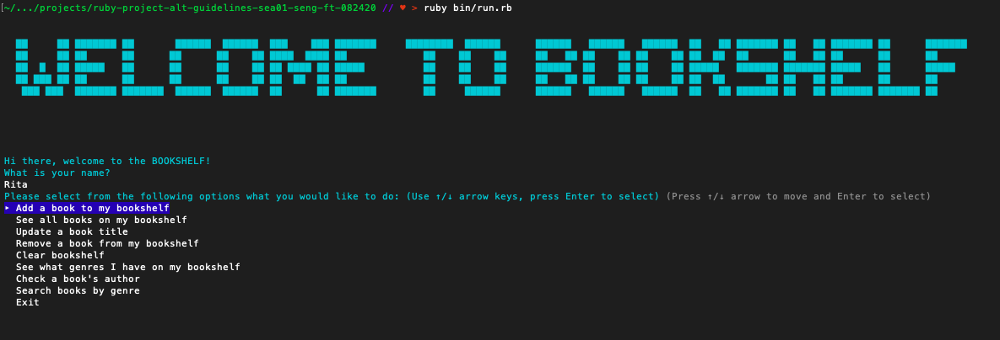

# _THE BOOKSHELF CLI APP_

#### By _**Margarita Morozova & Jackson Beytebiere**_

## Description
This application is a virtual bookshelf that allows users to organize their book collection and keep track of books they would like to read in the future. The Bookshelf was created for Flatiron's Module 1 project to demonstrate working knowledge of Ruby, Active Record Associations, CRUD methods and working with a database.

Functionality of The Bookshelf includes:
1. Creating a bookshelf associated with a username
2. Adding books to the bookshelf including the author name and genre
3. Searching the books on the bookshelf by author name or genre
4. Viewing bookshelf collection
5. Removing a book or entire bookshelf

## Setup
1. Clone the bookshelf repository into your computer
2. Within your terminal, navigate to the application folder (make sure to maximize your terminal window to allow the text to be correctly dispayed)
3. Enter 'bundle install' to make sure that your computer has the required gems
4. Enter 'rake db:migrate' to create necessary database tables
5. Enter 'rake db:seed' if you want to load dummy data. It will create two bookshelves under the names 'Rita' and 'Jackson'
6. Enter 'ruby bin/run.rb'
7. Enjoy!

## Known Bugs
* None. 

## Technologies used:
* Ruby
* ActiveRecord 5.2
* TTY::Prompt Gem
* Colorize Gem
* Faker Gem

[Video demo](https://www.youtube.com/watch?v=eYNUSFGpr2o&t=72s)

### Legal
This code is considered public domain.

Margarita Morozova https://github.com/rita-morozova
Jackson Beytebiere https://github.com/JacksonBey
